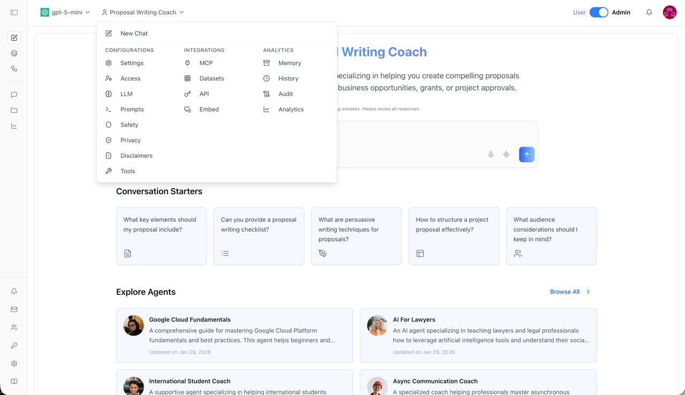
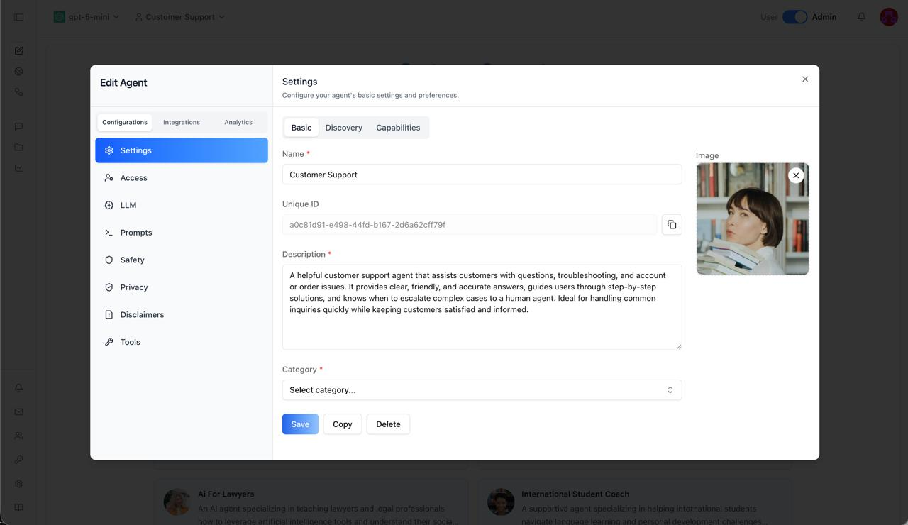
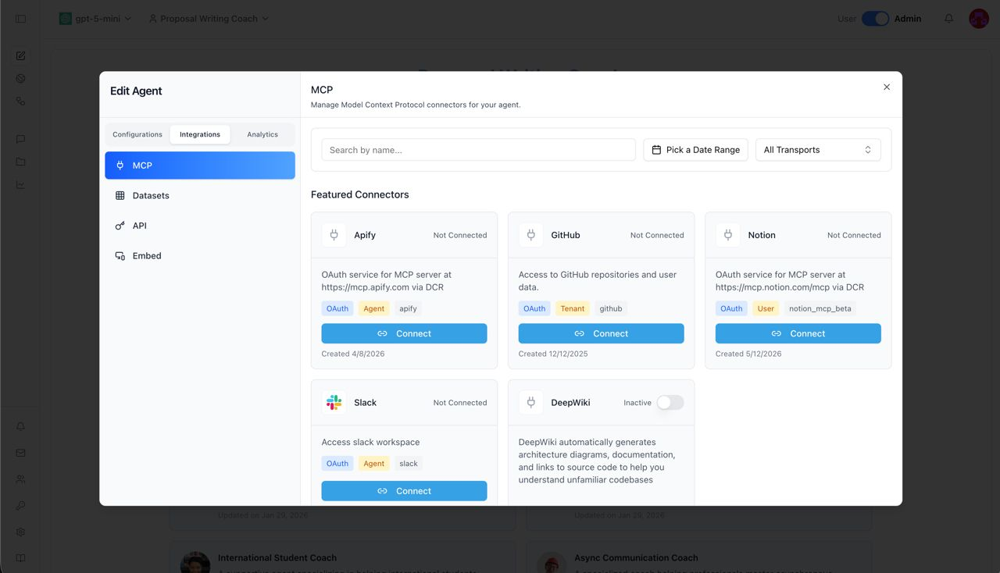
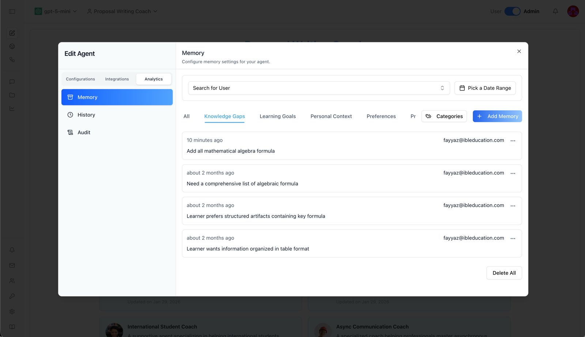
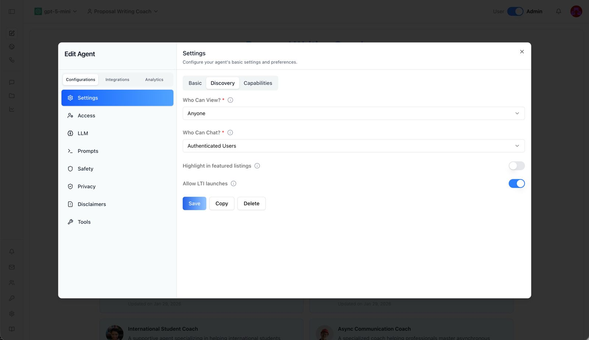

<div align="center">

<a href="https://ibl.ai"></a>

# OS

**The open-source AI agent platform.**

Build, deploy, and manage intelligent conversational agents — from prototype to production — in minutes.

[](https://ibl.ai)
[](https://docs.ibl.ai)
[](LICENSE)
[](https://nextjs.org)
[](https://github.com/iblai/vibe/blob/main/skills/iblai-ops-build/SKILL.md)
[](https://github.com/iblai/vibe/blob/main/skills/iblai-ops-build/SKILL.md)
[](https://github.com/iblai/vibe/blob/main/skills/iblai-ops-build/SKILL.md)
[](https://github.com/iblai/vibe/blob/main/skills/iblai-ops-build/SKILL.md)

[](https://youtu.be/P2ph8FAB0nI) **Demo by Miguel Amigot, CTO ibl.ai**

[Features](#features) · [Screenshots](#screenshots) · [Quick Start](#quick-start) · [Deployment](#deployment) · [Contributing](#contributing)

</div>

---

## Features

- **AI Agents** — Create custom agents with configurable LLMs, system prompts, tools, and safety filters
- **RAG Training** — Upload documents, connect Google Drive, OneDrive, Dropbox, or crawl websites to ground agents in your data
- **Voice Calls** — Real-time WebRTC voice chat powered by LiveKit
- **Deep Research** — Extended multi-step reasoning for complex queries
- **Canvas / Artifacts** — Generate, edit, and version rich documents alongside chat
- **Screen Sharing** — Share your screen directly inside a chat session
- **Web Search** — Ground responses with live web results
- **MCP Servers** — Extend agent capabilities with Model Context Protocol tool servers
- **Analytics** — Usage dashboards, topic analysis, transcript viewer, and financial reporting
- **Projects** — Collaborative workspaces to group agents with shared context and goals
- **Cross-Platform** — Ships as web, desktop (macOS, Windows, Linux), and mobile (iOS, Android)
- **Multi-tenancy** — Full tenant isolation with per-org configuration, branding, and user management
- **SSO** — Single Sign-On with configurable identity providers (OAuth, OIDC, SAML)
- **RBAC** — Granular role-based access control with policies and group-based permissions
- **Stripe Billing** — Subscription management, free trials, and usage-based pricing
- **Embed Mode** — Embed agents in any website via iframe with custom styling
- **Custom Domains** — Host agents on your own domain
- **API Keys** — Programmatic access for integrations and automation
- **Whitelabeling** — Custom branding, logos, and disclaimers

---

## Screenshots

<div align="center">



_Configure agents with LLMs, prompts, safety filters, and explore conversation starters_



_Customize agent identity, description, and appearance_



_Connect to external services via Model Context Protocol — GitHub, Notion, Slack, and more_



_Manage agent memory with knowledge gaps, learning goals, and user preferences_



_Control agent visibility, access permissions, and LTI integration_

</div>

---

## Available On

<div align="center">

| Platform    | Status                                                                     |
| ----------- | -------------------------------------------------------------------------- |
| **Web**     | Production at [os.ibl.ai](https://os.ibl.ai) — works on any modern browser |
| **macOS**   | Native desktop app — lightweight, fast, system-integrated                  |
| **iOS**     | Native mobile app — available on iPhone and iPad                           |
| **Android** | Native mobile app — available on phones and tablets                        |
| **Windows** | Native desktop app                                                         |
| **Linux**   | Native desktop app                                                         |

</div>

One codebase, six platforms. OS runs natively everywhere your users are — lightweight, fast, with near-native performance.

---

## Quick Start

```bash
git clone https://github.com/iblai/os.git
cd os
pnpm install
```

**Using [Claude Code](https://claude.ai/claude-code)?** Run `/setup` — it will walk you through connecting your ibl.ai tenant and configuring `.env.local` automatically.

**Manual setup:** Copy `.env.example` to `.env.local`, then set `NEXT_PUBLIC_MAIN_TENANT_KEY` to your org key from [login.iblai.app/me](https://login.iblai.app/me).

```bash
cp .env.example .env.local   # then edit NEXT_PUBLIC_MAIN_TENANT_KEY
pnpm dev
```

Open [http://localhost:3000](http://localhost:3000). See the full [Development Guide](docs/development.md) for environment variables, scripts, and architecture details.

---

## Deployment

OS is the frontend for the ibl.ai platform. Choose your path based on your backend setup:

### Option A: Existing ibl.ai Tenant

If you already have an ibl.ai tenant (organization key):

1. **Configure your tenant**

   ```bash
   cp .env.example .env.local
   ```

   Update these values with your tenant details:

   ```bash
   NEXT_PUBLIC_TENANT=your-tenant
   ```

2. **Deploy with Docker** (recommended)

   ```bash
   docker build -t os .
   docker run -p 5000:5000 --env-file .env.local os
   ```

   Or **deploy standalone**:

   ```bash
   pnpm build
   PORT=3000 node server-wrapper.js
   ```

### Option B: Enterprise Deployment

If you need full backend infrastructure:

1. **Get an enterprise license**

   Reach out at [ibl.ai/contact](https://ibl.ai/contact) to get a license of the enterprise platform (full backend codebase).

2. **Deploy with our infra CLI**

   If you already have access to our Docker images, deploy them easily via [iblai/iblai-infra-cli](https://github.com/iblai/iblai-infra-cli).

> **Note**: OS requires the ibl.ai backend platform for authentication, AI agent APIs, and data services. The backend is not included in this repository — visit [ibl.ai](https://ibl.ai) to get started.

### Desktop & Mobile

See [docs/development.md](docs/development.md) for native app build instructions.

Full deployment docs: [Docker & Standalone](docs/standalone-deployment.md)

---

## Contributing

We welcome contributions! Please see [CONTRIBUTING.md](CONTRIBUTING.md) for guidelines. If you'll be working with AI-assisted tooling, read [AGENTS.md](AGENTS.md) first — it documents the formatting, lint, and push protocol rules that the husky hooks enforce.

---

## Resources

- [Documentation](https://docs.ibl.ai)
- [Development Guide](docs/development.md) — setup, scripts, architecture, configuration
- [iblai-app-cli](https://github.com/iblai/iblai-app-cli) — CLI for scaffolding ibl.ai apps
- [@iblai/mcp](https://www.npmjs.com/package/@iblai/mcp) — MCP server for AI-assisted development
- [Vibe](https://github.com/iblai/vibe) — developer toolkit for building with ibl.ai
- [Vibe Starter](https://github.com/iblai/vibe-starter) — pre-wired Next.js + ibl.ai SSO template

---

## License

MIT License. See [LICENSE](LICENSE) for details.
