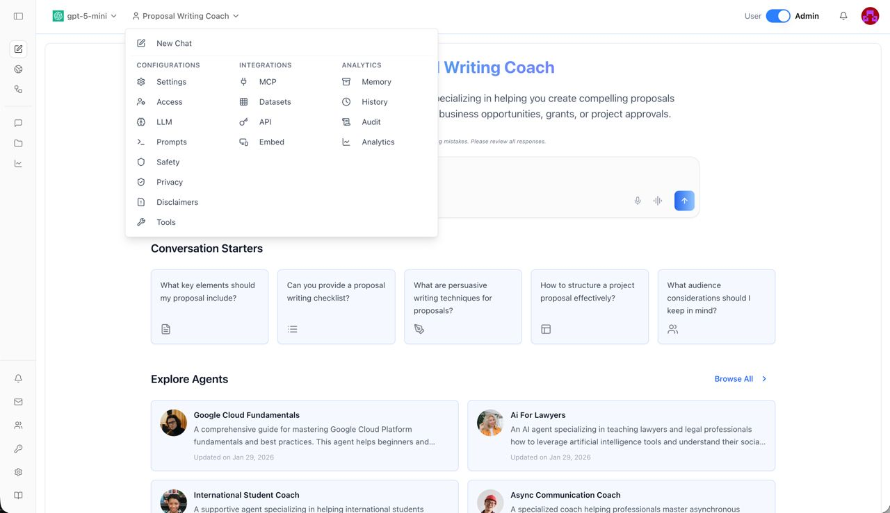
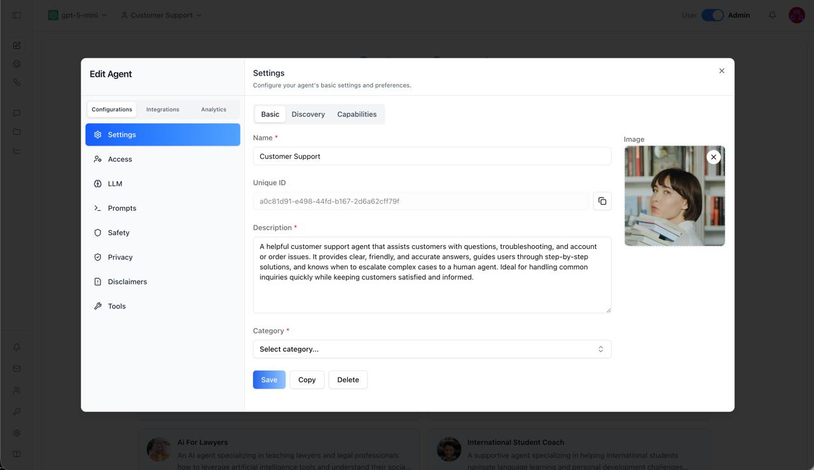
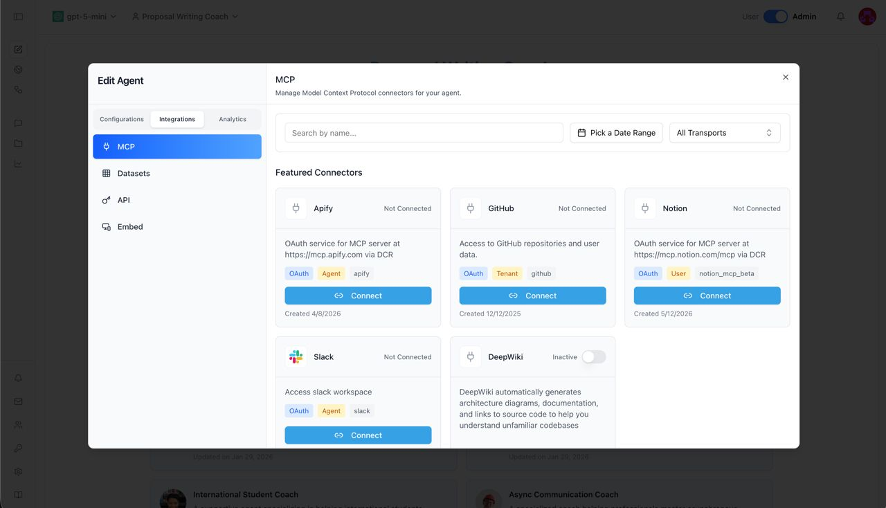
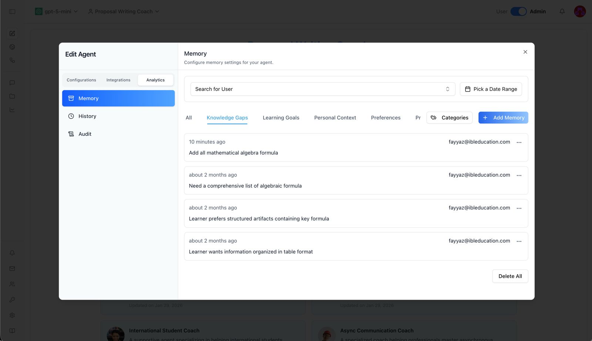
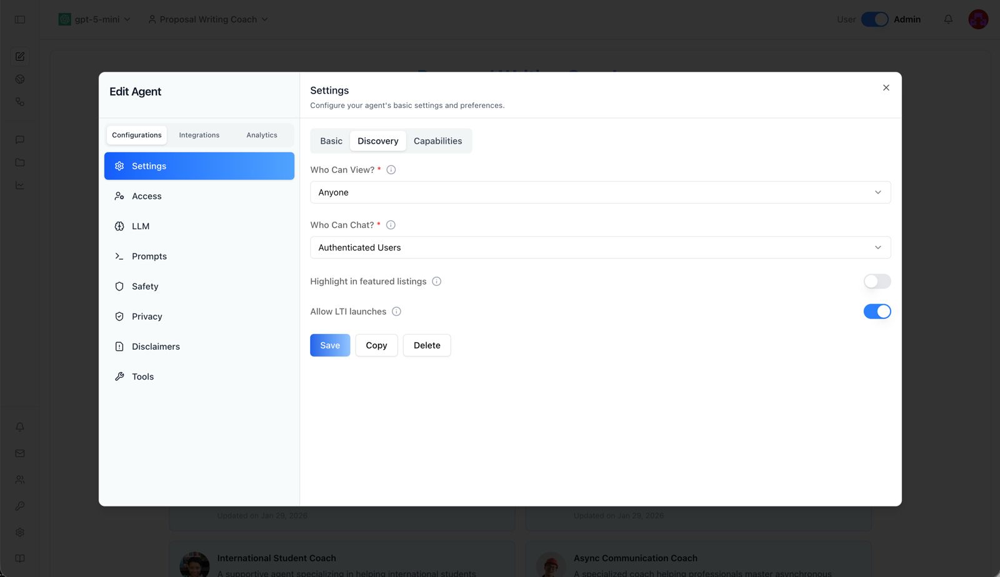

<div align="center">

<a href="https://ibl.ai"></a>

# ibl.ai/os

**The open-source AI agent platform.**

Build, deploy, and manage intelligent conversational agents — from prototype to production, in minutes. One codebase. Every platform. Your code, your data, any LLM.

[](https://ibl.ai/join)
[](https://ibl.ai)
[](https://ibl.ai/docs)
[](LICENSE)
[](https://ibl.ai)

<br>

### ⬇️ Get ibl.ai/os

<a href="https://os.ibl.ai"></a>
&nbsp;
<a href="https://github.com/iblai/os/releases/download/app-v0.95.19/ibl.ai_0.95.19_universal.dmg"></a>
&nbsp;
<a href="https://github.com/iblai/os/releases/download/app-v0.95.19/ibl.ai_0.95.19_x64-setup.exe"></a>

<a href="https://apps.apple.com/us/app/ibl-ai/id6504929071"></a>
&nbsp;
<a href="https://play.google.com/store/apps/details?id=ai.ibl.mentorai"></a>

<sub>Windows ARM64 · older builds · Linux → [all downloads](docs/DOWNLOADS.md)</sub>

<!--
Chrome extension download — hidden until our extension is approved on the Chrome Web Store.
Restore EXTENSION_ID and re-add these two spots:
  1) "Get ibl.ai/os" badge row (after the "Use it on the Web" badge):
     <a href="https://chromewebstore.google.com/detail/EXTENSION_ID"></a>
     &nbsp;
  2) "Every platform, one codebase" table (after the Web row):
     | **Chrome**  | 🧩  | Side-panel extension — [Chrome Web Store](https://chromewebstore.google.com/detail/EXTENSION_ID) (chat with your agents on any page) |
-->

<br>

[](https://www.youtube.com/playlist?list=PLW0-4yErlU3XQr0UP6cCGwy24LMf7I5vR)

**▶︎ [Watch the demo](https://www.youtube.com/playlist?list=PLW0-4yErlU3XQr0UP6cCGwy24LMf7I5vR)** &nbsp;·&nbsp; _by Miguel Amigot, CTO at ibl.ai_

<br>

[Why ibl.ai/os](#why-iblaios) · [Every platform](#every-platform-one-codebase) · [Features](#features) · [Case studies](#case-studies) · [Screenshots](#screenshots) · [Quick Start](#quick-start) · [Deployment](#deployment)

</div>

---

<div align="center">

**SOC 2 Type II** &nbsp;·&nbsp; Universities, enterprises, and governments run on ibl.ai — [read the case studies →](https://ibl.ai/case-studies)

</div>

---

## Why ibl.ai/os

|                             |                                                                                                                       |
| --------------------------- | --------------------------------------------------------------------------------------------------------------------- |
| 🔓 **Your code, your data** | MIT-licensed and self-hostable. No vendor lock-in — full ownership of the stack and everything that flows through it. |
| 🧠 **Any LLM, your choice** | Bring OpenAI, Anthropic, Google, Microsoft, Meta, or your own models. Switch providers without rewrites.              |
| 📱 **Truly everywhere**     | One codebase ships as web, macOS, Windows, Linux, iOS, and Android — with near-native performance.                    |
| 🏢 **Enterprise-ready**     | Multi-tenancy, SSO, RBAC, Stripe billing, and whitelabeling built in — not bolted on later.                           |

---

## Every platform, one codebase

Most AI apps make you choose a device. ibl.ai/os meets your users wherever they are — the same product, native everywhere.

<div align="center">

| Platform    |     | Status                                                                                                |
| ----------- | --- | ----------------------------------------------------------------------------------------------------- |
| **Web**     | 🌐  | Live at **[os.ibl.ai](https://os.ibl.ai)** — any modern browser                                       |
| **macOS**   | 🍎  | Native app — [download universal .dmg](docs/DOWNLOADS.md) (Intel + Apple Silicon, signed & notarized) |
| **Windows** | 🪟  | Native app — [download installer](docs/DOWNLOADS.md) (x64 + ARM64)                                    |
| **iOS**     | 📱  | Native app — [App Store](https://apps.apple.com/us/app/ibl-ai/id6504929071)                           |
| **Android** | 🤖  | Native app — [Google Play](https://play.google.com/store/apps/details?id=ai.ibl.mentorai)             |
| **Linux**   | 🐧  | Native app — [build from source](docs/development.md)                                                 |

</div>

---

## Features

<table>
<tr>
<td width="50%" valign="top">

**🤖 Build & customize**

- **AI Agents** — configurable LLMs, system prompts, tools, and safety filters
- **Projects** — collaborative workspaces with shared context and goals
- **Canvas / Artifacts** — generate, edit, and version rich documents alongside chat
- **MCP Servers** — extend agents with Model Context Protocol tool servers

**📚 Ground in your data**

- **RAG Training** — upload docs, connect Google Drive / OneDrive / Dropbox, or crawl sites
- **Web Search** — ground responses with live web results
- **Deep Research** — extended multi-step reasoning for complex queries

</td>
<td width="50%" valign="top">

**🎙️ Rich conversations**

- **Voice Calls** — real-time WebRTC voice chat powered by LiveKit
- **Screen Sharing** — share your screen directly inside a session

**🏢 Operate & scale**

- **Analytics** — usage dashboards, topic analysis, transcripts, financial reporting
- **Multi-tenancy** — full tenant isolation, per-org branding & user management
- **SSO & RBAC** — OAuth / OIDC / SAML with granular role-based access
- **Stripe Billing** — subscriptions, free trials, usage-based pricing
- **Embed & API** — iframe embed mode, custom domains, and API keys
- **Whitelabeling** — custom branding, logos, and disclaimers

</td>
</tr>
</table>

---

## Case studies

Universities, enterprises, and government agencies build on ibl.ai — deploying agents on their own infrastructure, with their own models, at a fraction of the cost of closed platforms.

**[Read the case studies →](https://ibl.ai/case-studies)**

---

## Screenshots

<div align="center">



<sub>**Agent configuration** — dial in LLMs, prompts, safety filters, and conversation starters</sub>

<br><br>

<table>
<tr>
<td width="50%"><br><sub><b>Agent settings</b> — identity, description, and appearance</sub></td>
<td width="50%"><br><sub><b>MCP connectors</b> — GitHub, Notion, Slack, and more</sub></td>
</tr>
<tr>
<td width="50%"><br><sub><b>Memory</b> — knowledge gaps, learning goals, preferences</sub></td>
<td width="50%"><br><sub><b>Discovery</b> — visibility, access permissions, and LTI</sub></td>
</tr>
</table>

</div>

---

## Quick Start

```bash
git clone https://github.com/iblai/os.git
cd os
pnpm install
```

**Using [Claude Code](https://claude.ai/claude-code)?** Run `/setup` — it walks you through connecting your ibl.ai tenant and configuring `.env.local` automatically.

**Manual setup:** Copy `.env.example` to `.env.local`, then set `NEXT_PUBLIC_MAIN_TENANT_KEY` to your org key from [login.iblai.app/me](https://login.iblai.app/me).

```bash
cp .env.example .env.local   # then edit NEXT_PUBLIC_MAIN_TENANT_KEY
pnpm dev
```

Open [http://localhost:3000](http://localhost:3000). See the full [Development Guide](docs/development.md) for environment variables, scripts, and architecture details.

---

## Deployment

ibl.ai/os is the frontend for the ibl.ai platform. Choose your path based on your backend setup:

### Option A: Existing ibl.ai Tenant

If you already have an ibl.ai tenant (organization key):

1. **Configure your tenant**

   ```bash
   cp .env.example .env.local
   ```

   Update these values with your tenant details:

   ```bash
   NEXT_PUBLIC_TENANT=your-tenant
   ```

2. **Deploy with Docker** (recommended)

   ```bash
   docker build -t os .
   docker run -p 5000:5000 --env-file .env.local os
   ```

   Or **deploy standalone**:

   ```bash
   pnpm build
   PORT=3000 node server-wrapper.js
   ```

   The build emits a self-contained server under `.next/standalone/` (Next.js
   [standalone output](https://nextjs.org/docs/app/api-reference/config/next-config-js/output)).
   `next.config.ts` pins `outputFileTracingRoot` to the project directory so the
   output always lands at `.next/standalone/server.js` with its static assets
   alongside it. See [Troubleshooting](#troubleshooting) if the app loads to a
   blank screen.

### Option B: Enterprise Deployment

If you need full backend infrastructure:

1. **Get an enterprise license**

   Reach out at [ibl.ai/contact](https://ibl.ai/contact) to get a license of the enterprise platform (full backend codebase).

2. **Deploy with our infra CLI**

   If you already have access to our Docker images, deploy them easily via [iblai/iblai-infra-cli](https://github.com/iblai/iblai-infra-cli).

> **Note**: ibl.ai/os requires the ibl.ai backend platform for authentication, AI agent APIs, and data services. The backend is not included in this repository — visit [ibl.ai](https://ibl.ai) to get started.

### Every surface, on your own backend

Ship **Web, macOS, Windows/Surface, Linux, iOS, and Android** pointed at your own deployment — one web codebase, with the native apps as webview shells around it:

**→ [Platform deployment guide](docs/platform-deployment.md)** (per-surface build, backend config, and release).

Full deployment docs: [Docker & Standalone](docs/standalone-deployment.md) · [native app dev](docs/development.md)

#### Build-Time Configuration

The native (Tauri) app reads two optional build-time flags. Because they're
baked in at compile time (Rust's `option_env!`), you set them as **environment
variables in the build shell** before `pnpm exec tauri build` — so the same
codebase can produce differently-configured builds from the same app URL (e.g.
one build locked to tenant A, another to tenant B).

| Env var                     | Tauri command                    | Default         | Effect                                                                                                                                                                  |
| --------------------------- | -------------------------------- | --------------- | ----------------------------------------------------------------------------------------------------------------------------------------------------------------------- |
| `IBL_TENANT`                | `get_locked_tenant` → `string`   | `""` (unlocked) | **Tenant lock.** When set, the app forces every user onto this tenant — logging out of any other tenant it finds — and hides the tenant switcher. Empty = multi-tenant. |
| `IBL_ALLOW_IN_APP_PURCHASE` | `allow_in_app_purchase` → `bool` | `false`         | Enables in-app purchase UI. Truthy values: `1`, `true`, `yes`, `on` (case-insensitive).                                                                                 |

```bash
# a build locked to the "acme" tenant with in-app purchase enabled
IBL_TENANT=acme IBL_ALLOW_IN_APP_PURCHASE=true pnpm exec tauri build
```

In CI, set them as `env` on the build step. `src-tauri/build.rs` declares
`cargo:rerun-if-env-changed` for both, so cargo recompiles whenever a value
changes between builds. Leaving them unset yields a standard, unlocked build.

### Troubleshooting

**The app loads to a blank page or stays stuck on the loading spinner (no redirect to login).**

Open your browser's DevTools → Network tab and reload. If every request under
`/_next/static/...` and `/env.js` returns `404`/`503`, the server isn't finding
its static assets. Two common causes:

- **A duplicate or stale server is bound to the port.** An older `node`/`next`
  process from a previous run can keep listening on `:3000` and shadow the new
  one (a process bound to a specific address such as `127.0.0.1` wins over a
  wildcard bind). Find and stop strays before starting fresh:

  ```bash
  lsof -nP -iTCP:3000 -sTCP:LISTEN   # list listeners on the port
  kill <PID>                         # stop the stale one
  ```

- **The standalone output was nested under an unexpected path.** Next.js infers
  the file-tracing root from the nearest lockfile. A stray lockfile in a _parent_
  directory (e.g. `~/package-lock.json`) makes it treat your home directory as
  the workspace root and emit the server at `.next/standalone/<path-to-project>/server.js`
  instead of `.next/standalone/server.js` — `post-build.sh` then copies static
  assets next to the wrong path and `server-wrapper.js` can't find the server.
  This repo pins `outputFileTracingRoot` in `next.config.ts` to prevent it; if
  you still hit nesting, remove the stray parent lockfile and rebuild.

---

## Testing

This project is covered by Playwright end-to-end tests in [`e2e/`](e2e/). **Run the E2E suite for any change** so nothing regresses:

```bash
make e2e-ui
```

`make e2e-ui` launches Playwright in interactive UI mode — watch the journeys run, step through them, and re-run individual tests. The first time, install the browsers once:

```bash
make e2e-install
```

Other useful targets:

| Command                 | What it does                               |
| ----------------------- | ------------------------------------------ |
| `make e2e`              | Run the full suite headless (all browsers) |
| `make e2e-headed`       | Run with a visible browser                 |
| `make e2e-chrome`       | Run on Chrome only                         |
| `make e2e-journey J=01` | Run a single journey spec                  |
| `make e2e-report`       | Open the last HTML report                  |

See [e2e/COVERAGE.md](e2e/COVERAGE.md) for current coverage. Coverage must not regress — add or update a journey whenever you change user-facing behavior.

---

## Contributing

We welcome contributions! Please see [CONTRIBUTING.md](CONTRIBUTING.md) for guidelines. If you'll be working with AI-assisted tooling, read [AGENTS.md](AGENTS.md) first — it documents the formatting, lint, and push protocol rules that the husky hooks enforce.

---

## Resources

- [Documentation](https://ibl.ai/docs)
- [Development Guide](docs/development.md) — setup, scripts, architecture, configuration
- [iblai-app-cli](https://github.com/iblai/iblai-app-cli) — CLI for scaffolding ibl.ai apps
- [@iblai/mcp](https://www.npmjs.com/package/@iblai/mcp) — MCP server for AI-assisted development
- [Vibe](https://github.com/iblai/vibe) — developer toolkit for building with ibl.ai
- [Vibe Starter](https://github.com/iblai/vibe-starter) — pre-wired Next.js + ibl.ai SSO template

---

<div align="center">

## License

MIT License. See [LICENSE](LICENSE) for details.

<br>

**[ibl.ai](https://ibl.ai)** · Your organization's AI, under your control.

</div>
